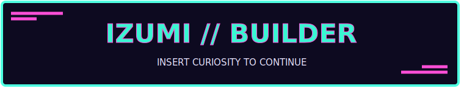
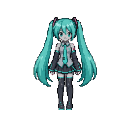
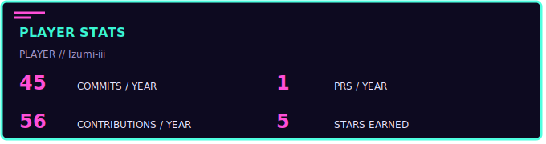
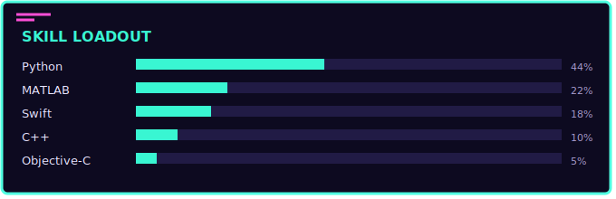
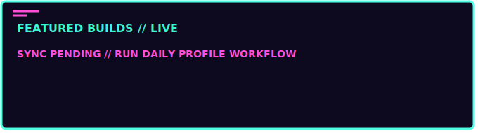
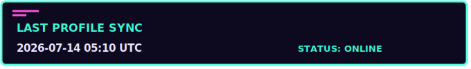

  
   
  

  
<code>PLAYER 01 // ONLINE</code>

  
<strong>Student developer exploring AI, algorithms &amp; macOS apps.</strong>

  
你好，我在把好奇心做成可以运行的东西。

  

    <a href="https://github.com/Izumi-iii">GitHub</a>
    ·
    <a href="mailto:depressing113@foxmail.com">Email</a>
  

## `01 // CURRENT QUEST`

  

## `02 // PLAYER STATS`

  
   
  

## <code>03 // FEATURED BUILDS</code>

### [<code>magicState</code>](https://github.com/Izumi-iii/magicState)

An application-development experiment focused on turning ideas into an interactive product.

### [<code>downing_detect</code>](https://github.com/Izumi-iii/downing_detect)

A Python computer-vision project using YOLO to detect potential drowning risk in video streams.

### [<code>Algorithm</code>](https://github.com/Izumi-iii/Algorithm)

A growing C++ log of algorithm practice, problem-solving patterns, and implementation notes.

  

## `04 // CONTRIBUTION RUN`

  <picture>
    <source media="(prefers-color-scheme: dark)" srcset="https://raw.githubusercontent.com/Izumi-iii/Izumi-iii/output/contribution-snake-dark.svg" />
    <source media="(prefers-color-scheme: light)" srcset="https://raw.githubusercontent.com/Izumi-iii/Izumi-iii/output/contribution-snake.svg" />
    
  </picture>

---

  
   
  
  
<code>INSERT CURIOSITY TO CONTINUE</code>

